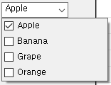
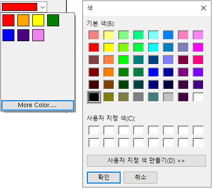
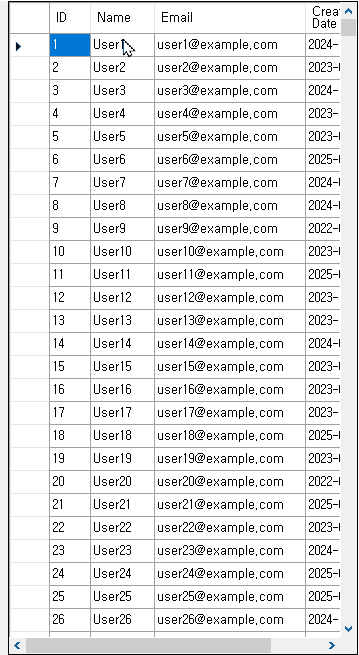
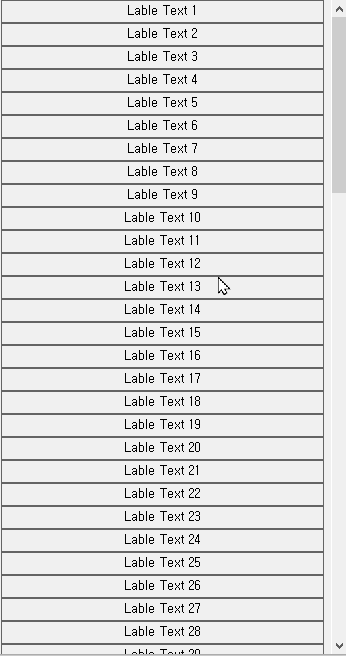

# GDombo_CustomControl

.NET Framework 4.8 기반으로 제작된 WinForms 전용 사용자 정의 컨트롤 모음입니다.  
Visual Studio 2022에서 개발되었으며, 보다 직관적인 UI 구성 요소들을 제공합니다.  
C#에서 기본적으로 제공하지 않는 컨트롤 중, 개인적으로 필요하다고 판단한 기능들을 직접 구현하여 추가했습니다.

---

## 프로젝트 개요

이 프로젝트는 C# WinForms에서 기본 컨트롤의 기능을 확장한 다음과 같은 커스텀 컨트롤을 제공합니다:

- **CheckBoxComboBox**  
  다중 선택이 가능한 콤보박스. 각 항목은 체크박스로 표시되며 선택 상태를 텍스트에 반영합니다.  

- **ColorComboBox**  
  ColorDialog 없이도 미리 정의된 색상 중 하나를 선택할 수 있는 컬러 콤보박스입니다. 드롭다운에서 색상 블록을 바로 선택 가능.  

- **DoubleBufferedDataGridView**  
  깜빡임 없는 부드러운 렌더링을 위한 더블 버퍼링이 적용된 DataGridView입니다.  

- **VerticalFlowLayout**  
  컨트롤들을 세로 방향으로 자동 정렬해주는 사용자 정의 레이아웃 패널입니다.  
  
---

## 기술 스택

- **Framework**: .NET Framework 4.8  
- **IDE**: Visual Studio 2022  
- **언어**: C# (.NET Windows Forms)  

---

## 설치 및 사용법

1. Visual Studio 2022에서 `GDombo_CustomControl.sln` 솔루션 열기
2. 솔루션 빌드 (`Ctrl + Shift + B`)
3. 빌드된 DLL을 다른 WinForms 프로젝트에서 참조하거나,
4. 소스 코드를 직접 복사하여 커스터마이징해 사용

  

---

# GDombo_CustomControl (English)

A collection of custom controls for WinForms, built on .NET Framework 4.8.  
Developed using Visual Studio 2022, it provides more intuitive UI components for desktop applications.  
It includes controls that are not provided by default in C#, but were implemented based on personal needs and use cases.

---

## Included Controls

- **CheckBoxComboBox**  
  A combo box allowing multiple selections with checkbox UI for each item. Selected values are displayed in the textbox.  

- **ColorComboBox**  
  A dropdown combo box with selectable color swatches, letting users pick a predefined color without a separate color dialog.  

- **DoubleBufferedDataGridView**  
  A flicker-free DataGridView that enables smoother rendering using double buffering.  

- **VerticalFlowLayout**  
  A custom layout panel that arranges controls vertically in flow style.  
  
---

## Tech Stack

- **Framework**: .NET Framework 4.8  
- **IDE**: Visual Studio 2022  
- **Language**: C# (WinForms)

---

## How to Use

1. Open the solution file `GDombo_CustomControl.sln` in Visual Studio 2022
2. Build the solution (`Ctrl + Shift + B`)
3. Add the built DLL to your project references  
   or copy the control source files directly into your project

---
